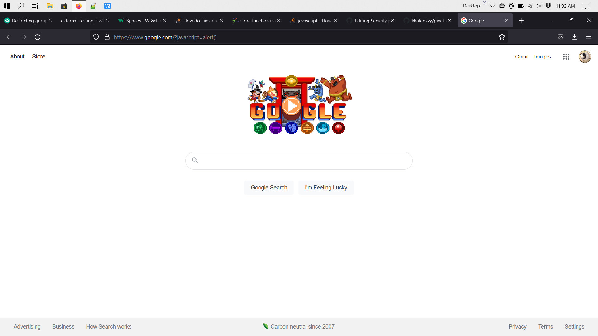
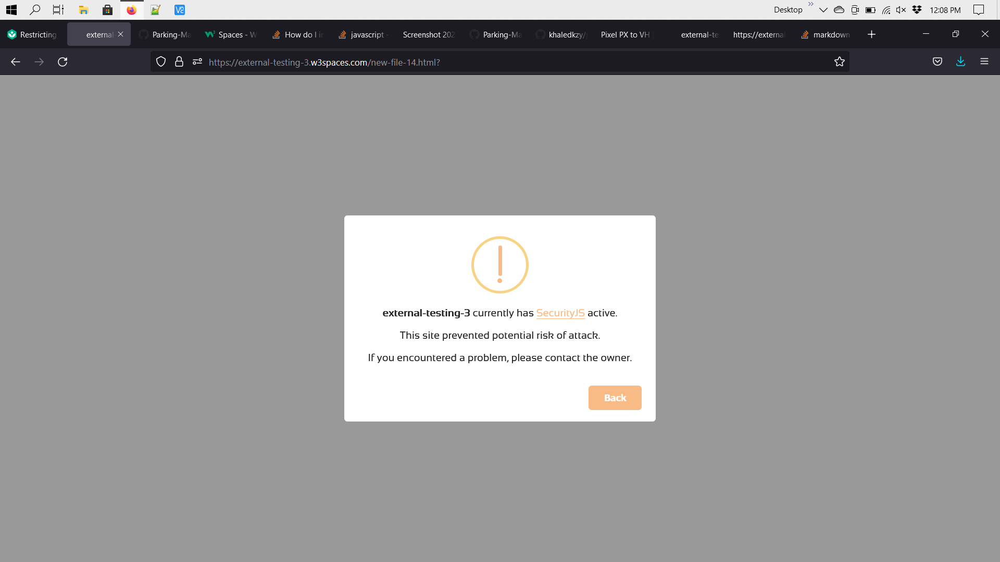

# SecurityJS
### Table of contents:
#### [Trusting certain and/or all loading sources](#trusting-certain-andor-all-loading-sources-1)
#### [Installing it with file/script tag](#without-further-ado-lets-install-it)
#### [SecurityJS Functions](#securityjs-functions)
#### [Using the same teqnique with `link` tags](#using-the-same-teqnique-with-link-tags-1)
#### [Blocking site from being embedded](#blocking-site-from-being-embedded-1)
<hr>
SecurityJS is a JavaScript shield protecter from various attacks on your site. It is free, safe, and fully customizable.

### Watch how I type in "javascript" In the url:


#### Nothing happens? This is a big security issue.

With SecurityJS, it cuts off all params including "javascript", ":javascript", "?javascript" and much more.

_But not just that. ― See more below_

It also stops loading sources from the **Developer console command line**, URL/URI Params, and unknown `<script>` tag sources such as `HTTP`.

### Trusting certain and/or all loading sources
*tip-*
If you trust a source from a certain script tag, you can either add the `trust` attribute (html), or add it in JavaScript:

###### HTML
```
  <script trust="true" src="http://github.io/example.js"></script>
```
###### JavaScript
```
  securityjs.trust('true', 1);
```
_the "1" in the function means it gets the element, e.g:_<br>
1, `<script src='url1'>`<br>
2, `<script src='url2'>`

*another tip-*
You can also trust all `<script>` tags. Example:
###### JavaScript
```
  securityjs.trustAll('javascript', 'true');
```
Specify what you want to trust, eg: 'javascript' (script tags) or 'css' (link tags).
### With SecurityJS:

  
Depending on your browser, it will output a message due to any issues such as:
  > **example.com** currently has <a href='#'>SecurityJS</a> active.<br>
  This site prevented potential risk of attack.<br>
  If you encountered a problem, please contact the owner.<br>
                                       <kbd>Back</kbd>

  #### Without further ado, let's install it:
  
  ### 1. Download full file
  The only step for this is to install it by download. 
  
  It will download *1* File.
  
  You can download it by the [download page](https://parking-master.github.io/Security.js/download.html)
  
  ### 2. Get by <a href='https://cdn.jsdelivr.net'>CDN</a>:
  You can easily get the JavaScript source code by embedding it:
  ```
  <script type='text/javascript' src='https://cdn.jsdelivr.net/gh/Parking-Master/Security.js/security.js'></script>
  ```
  **NOTE:** Please put the `<script>` tag right at the closing body tag, or else it won't block anything!
  
  Now, go ahead and try to type in the address bar: <kbd>https://[domain]?javascript=alert()</kbd>
  **NOTE:** Replace "[domain]" with your domain or site address.
  
  What happenend? It outputted a message! You can also open up the dev-console, and go to the logs. You'll see a warning by SecurityJS saying it blocked a possible attack.
  
  Go ahead and try it out.
  
  Now, let's get into more advanced properties.
  
  ### SecurityJS functions
  
  every SecurityJS Function starts with `securityjs`.
  ```
  securityjs.function('property', 'value', 'tag');
  ```
  (and has 3 arguments)
  #### How to block resources
  ###### JavaScript
  ```
    securityjs.block(type, what, string);
  ```
  ###### Detailed example:
  ```
    securityjs.block('url', 'javascript', 'not_allowed');
  ```
  ##### Output:
  1. <kbd>https://example.com?javascript</kbd>
  2. <kbd>https://example.com?not_allowed</kbd>
  
  #### Blocking console commands
  ###### JavaScript
  ```
  securityjs.block('console', 'load');
  ```
  This can block loading sources from the _JavaScript console_
  **Notice:** You only need 2 parameters for the console. You can use `what` or `str` for the last one.
  ##### Output:
  ```
  >> var script = document.createElement('script'); script.src = 'http://example.js'; document.body.appendChild(script);
  ```
  ```
  SecurityJS: blocked mixed content loading resource from 'http://example.js'.
  ```
  #### Please read the [documentation](doc.html) to see more `block` functions.
  
  ### Custom blockers
  ###### JavaScript
  ```
    securityjs.onexecute = function() {
    // do what you want to do
    alert('You are not welcomed!');
    };
  ```
  ##### Output:
  <kbd>http://example.com?javascript=myFunction()</kbd>
  > <br>
  >  You are not welcomed!<br>
  >  <ul><ul><kbd>OK</kbd>
  You can make any functions you want with `onexecute()`.
  
  ### Using the same teqnique with `link` tags
  You've probably gone through this whole tutorial without<br>knowing how to do the same with `link` tags.
  
  **You can easily** Do so just by blocking link tags.
###### SecurityJS (JavaScript)
```
  securityjs.block('source', 'link');
```
  OR  
```
  securityjs.block('source', 'link', 'http');
```
You can also use "**OR**" (||) or "**AND**" (&&):
```
  securityjs.block('source', 'link', 'http' || 'http://');
```
```
  securityjs.block('source', 'link', 'http' && 'http://');
```
  _This also works with the `script` tags too._
 ### SecurityJS `Auth()` function
  Authorize content to a specific IPv4 address, or password prompt
  <br>
  (it has to be public, or SecurityJS won't recognize it):
  ##### Syntax:
```
  securityjs.auth(type, string);
``` 
  ###### Example (JavaScript):
```
  securityjs.auth('ip', '8.8.8.8');
```
  ###### Passcode (JavaScript)
```
  securityjs.auth('passcode', '1secret-pass12!');
```
Accessing your authorized file ends up like this:
> Enter your passcode to access this file:<br>
> <ul><kbd>&nbsp;&nbsp;&nbsp;&nbsp;&nbsp;&nbsp;&nbsp;&nbsp;&nbsp;&nbsp;&nbsp;&nbsp;&nbsp;&nbsp;&nbsp;&nbsp;&nbsp;&nbsp;&nbsp;&nbsp;&nbsp;&nbsp;&nbsp;&nbsp;&nbsp;&nbsp;&nbsp;&nbsp;&nbsp;&nbsp;</kbd><br><ul><kbd>OK</kbd>&nbsp;&nbsp;<kbd>Cancel</kbd><br>

 ### Blocking site from being embedded
  You can block your site from being embedded using the `meta` tag:<br>
  (Note: Use the `meta` tag only in between the `head` tag).
  ###### HTML
  ```
    <meta name="X-Frame-Options" content="deny">
  ```
  To only allow it through your site domain, use "same-origin":
  ###### HTML
  ```
    <meta name="X-Frame-Options" content="same-origin">
  ```
  or...<br>
  ###### JavaScript
  ```
    securityjs.block('frame', 'all');<br>
  ```
  
  #### Did you like this project? Check out our other ones:<br>
  <kbd>[Parking Master](https://github.com/Parking-Master/Parking-Master)</kbd> | <kbd>[No-Time](https://github.com/Parking-Master/No-Time)</kbd>
